# Invictus Drive Assignment Readme 
## Module used-
### axios 
It is used to fetch data from url "https://raw.githubusercontent.com/invictustech/test/main/README.md"

In fetch.jsx content the functional component Fetch data is fetched and stored in text and useState and useEffect is usedfor it.
Their is function wordFreq inside Fetch in it we parse the fetched data in object containing words from the fetched data, then frequency of words is stored in it and for it pure logic is used no in-built module is used and then array of object is created containing key word, count and value word from string and their frequency and it is sorted in descending order.
Fetch function takes value and the array of object is slice to the number of value given to function for example if the passed value is 5 then the new array is of first 5 value of orignal arrray of object.
Fetch returns the table made from value of sliced array of object

In App.jsx contents the functional component in it we take input from input form and on click of button input value is set to a variable and it is passed to 

## Test Case-

### 1) When submit is pressed without entering any value in input field
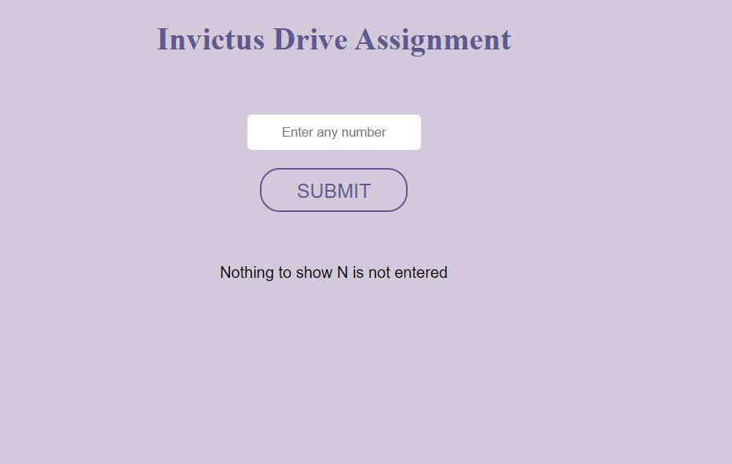

### 2) when 1 is input and submit is clicked
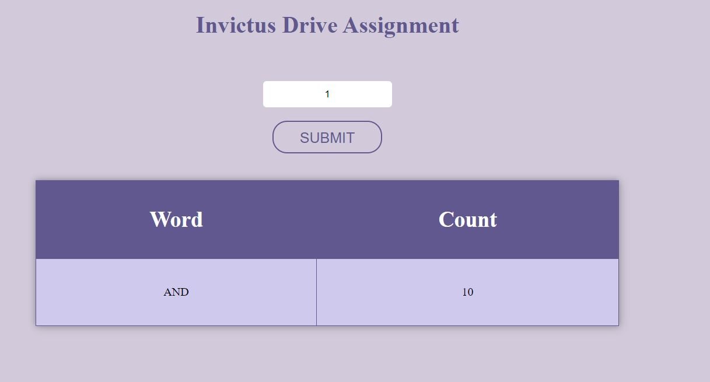

### 3) when 5 is input and submit is clicked

### 4) when input is negative and submit is clicked
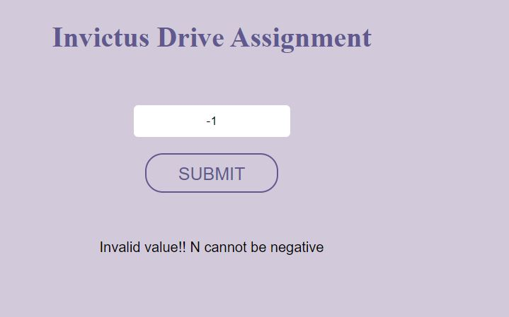

### 5) when 20 is input and submit is clicked
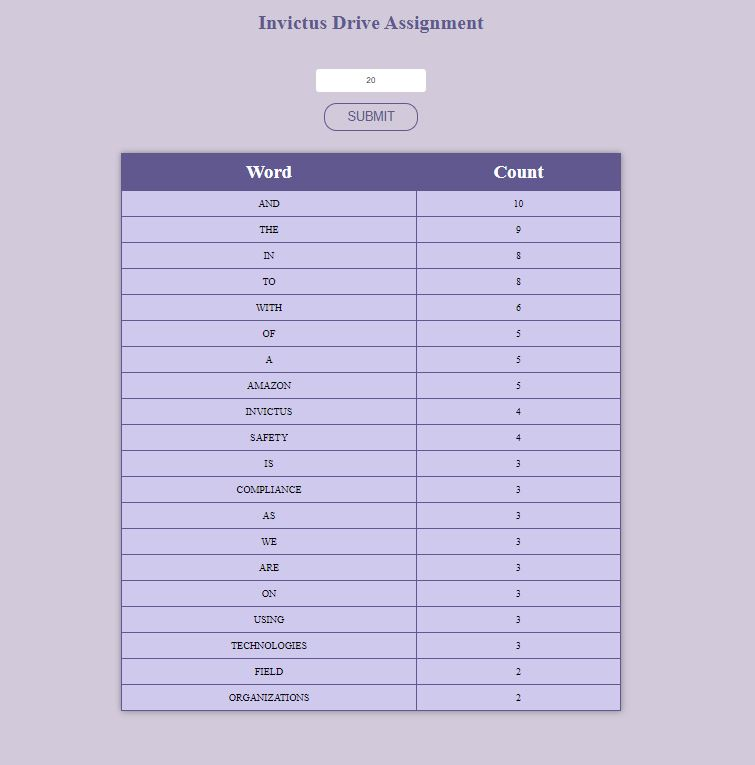

### 6) when 35 is input and submit is clicked
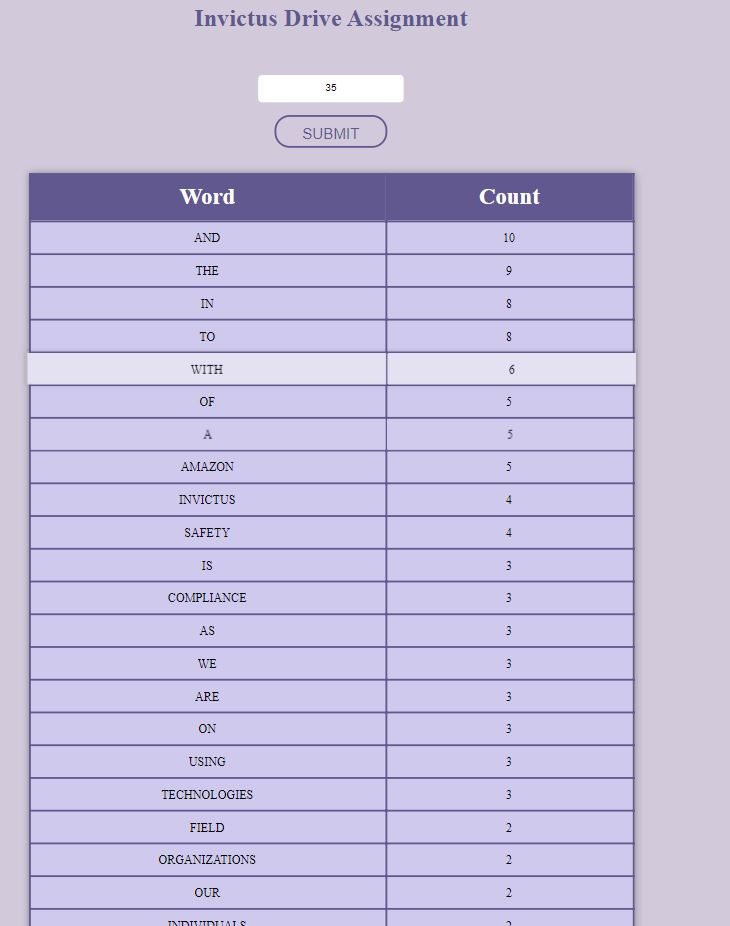
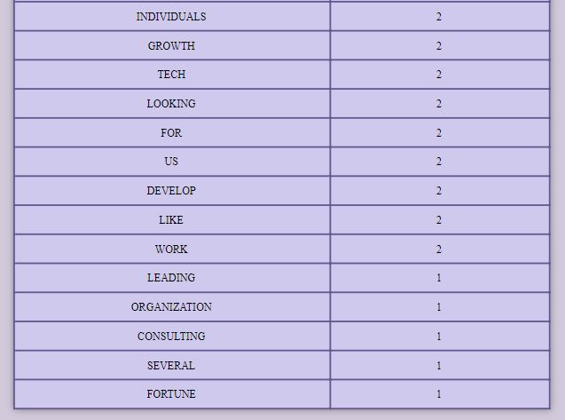

### 7) when 144 is input and submit is clicked
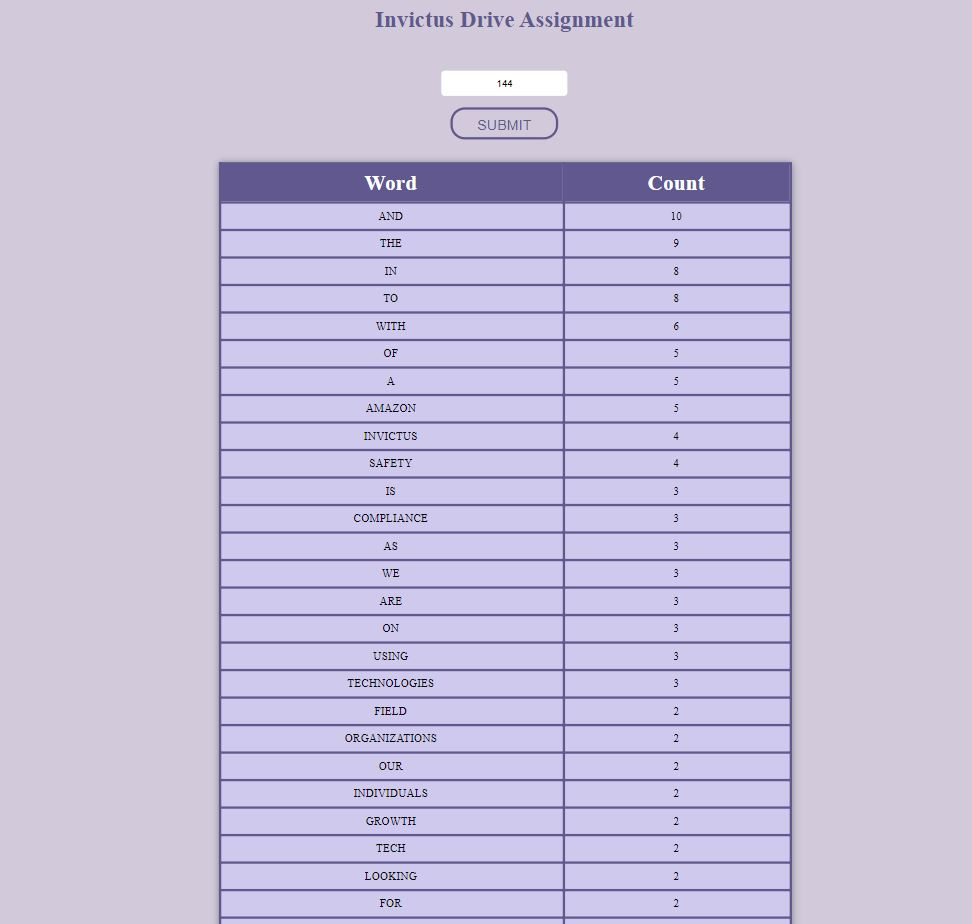
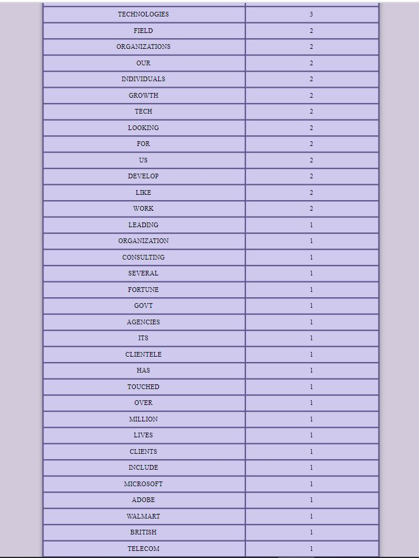
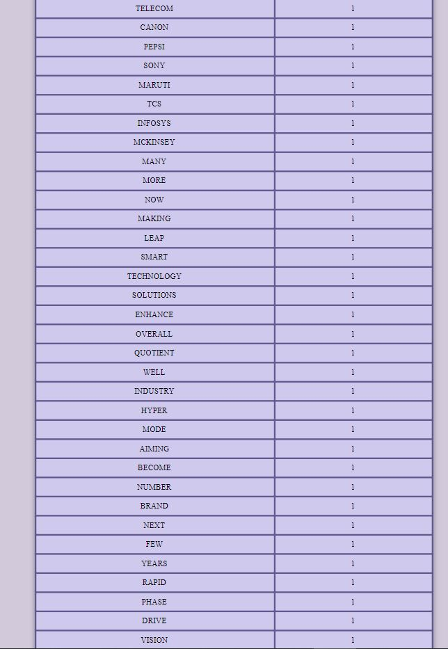
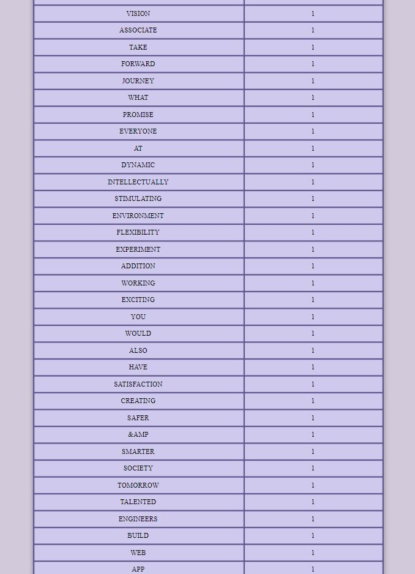
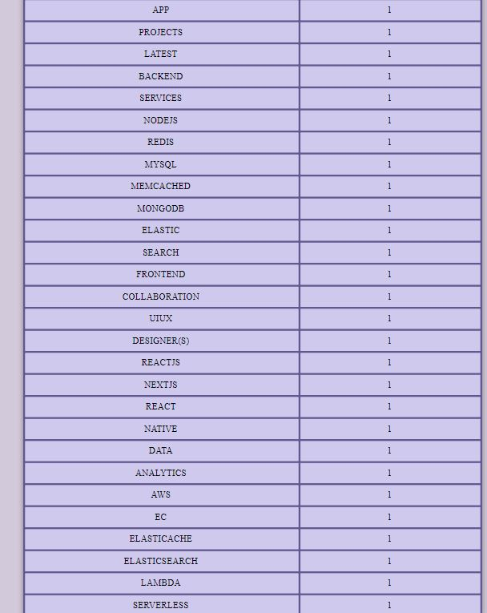

### 8) when 150 is input and submit is clicked
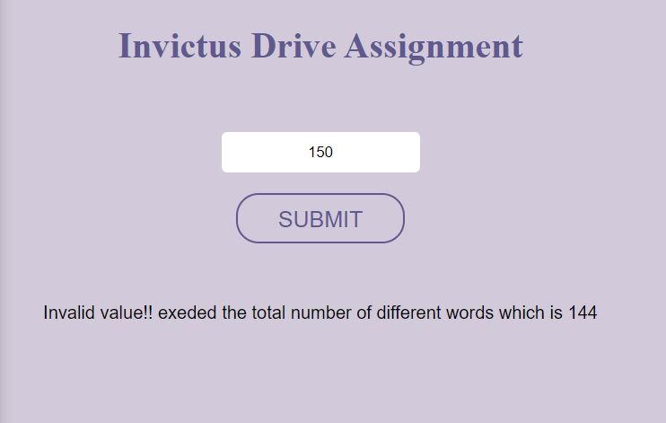

### 9) when 0 is input and submit is clicked
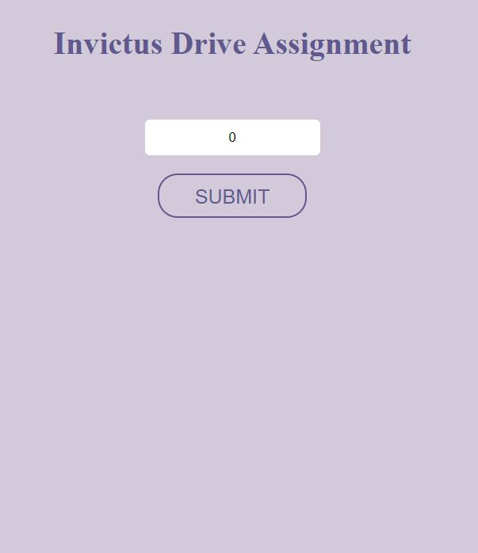

