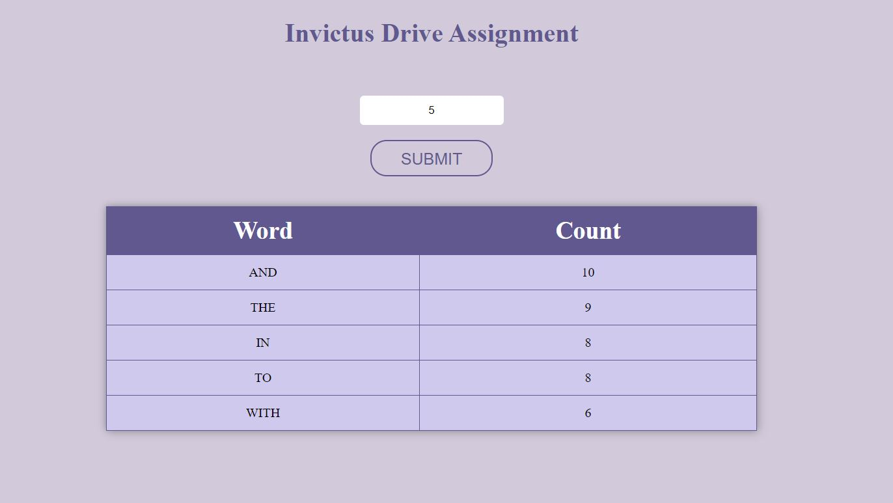

# Invictus Drive Assignment Readme 

<pre>
Name:Prathmesh Agrawal
Registration number: 11802444
College: Lovely Professional University
</pre>

## hosted on Heroku
### URL - https://invictusdriveassignment.herokuapp.com/

## Libraries used-
### axios 
It is used to fetch data from url "https://raw.githubusercontent.com/invictustech/test/main/README.md"

## components of the code-
Two functional components are made  
1)Fetch in fetch.jsx 
In Fetch data is fetched from url using axios module, after in function wordFreq , - . ; are removed and words are splited and stoed in object named words and frquency of every word in words is find using logic 
<pre>
    var freqMap = {};
    words.forEach(function(w) {
        if (!freqMap[w]) {
            freqMap[w] = 0;
        }
        freqMap[w] += 1;
    });
</pre>
and pushed into array name array and then each word in array assigned key "word" and freq of that word key "count" and stored in resultarray, resultarray is sliced as the value given to functional component as parameter then Fetch functional component returns the table formed from sliced array.  
2)App in App.jsx 
In App react useState is used to store value of input form and on click on button change function is triggered which store the input value in variable name num which is passed to the Fetch component.

## Test Case-

### 1) When submit is pressed without entering any value in input field

### 2) when 1 is input and submit is clicked

### 3) when 5 is input and submit is clicked

### 4) when input is negative and submit is clicked

### 5) when 20 is input and submit is clicked

### 6) when 35 is input and submit is clicked

### 7) when 144 is input and submit is clicked

### 8) when 150 is input and submit is clicked

### 9) when 0 is input and submit is clicked

